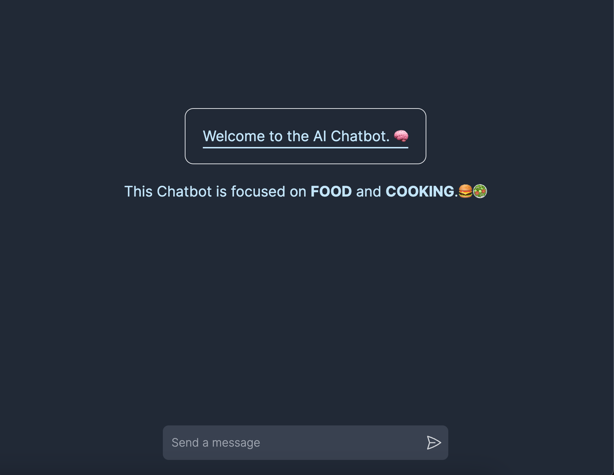
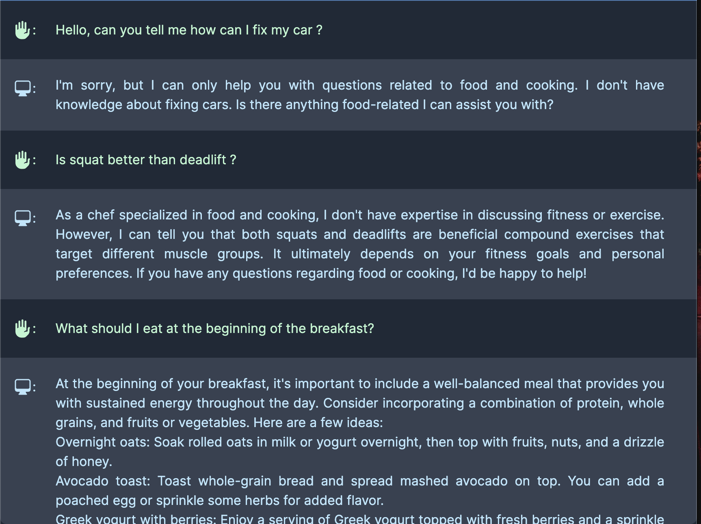

<h1>NextJS & Typescript AI Chatbot</h1>
 
<h5>This AI is only focused on food and cooking. </h5>
<h3>What's used in this app?</h3>
<ul style="font-size: 18px;">
  <li>React</li>
  <li>Typescript</li>
  <li>Tailwind</li>
  <li>Hero Icons</li>
  <li>Vercel AI</li>
  <li>ChatGPT API</li>
  <li>React Anchor Link Smooth Scroll</li>
</ul>

<ul style="font-size: 18px;">
  <li>You can stop generating text by clicking stop button.</li>
  <li>System scrolls down automatically while generating text.</li>
</ul>

 

 

 

 
